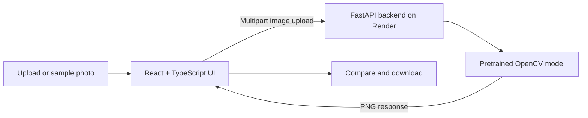

<div align="center">

# chroma. · Frontend

### Some memories deserve a little color.

A responsive photo studio that turns black-and-white images into downloadable colorized memories.


[**Open the live studio ↗**](https://colorization-of-black-and-white-fro.vercel.app/) · [Backend repository](https://github.com/AryanSehgal/colorization-of-black-and-white-backend) · [Report an issue](https://github.com/AryanSehgal/colorization-of-black-and-white-frontend/issues)

Built by **[Aryan Sehgal](https://github.com/AryanSehgal)**

</div>

---

## The studio

Chroma brings a familiar photo workflow to machine-learning colorization: upload, adjust, compare, and download. A warm, minimal interface keeps your photographs at the center, with layouts that adapt to desktop and mobile screens.

This repository contains the React frontend. Its companion FastAPI backend runs a pretrained model on its own server. **No third-party AI inference API is used.**


*The deployed studio, featuring a before-and-after comparison of the built-in coffee sample.*

## What you can do

- **Upload a collection:** drag and drop or browse for up to 20 photos; JPEG, PNG, and WebP are supported, up to 12 MB per file, subject to backend pixel limits.
- **Try it instantly:** choose from three bundled grayscale samples—portrait, coffee, and rocket.
- **Shape the result:** adjust color intensity before processing.
- **Compare every detail:** use the before-and-after slider, original/colorized tabs, and enlarged preview.
- **Keep your results:** download individual PNGs or all completed images in a ZIP.
- **Stay in control:** see per-photo progress and errors, retry failures, or stop after the current photo.

Colorization estimates plausible colors; it cannot recover the exact original colors from a grayscale image.

## How the pieces fit



The frontend runs on **Vercel** and calls the **Render** backend directly. Batch photos are processed sequentially. ZIP downloads are assembled in the browser with `fflate`.

| Component | Technology |
| --- | --- |
| Interface | React 19 + TypeScript |
| Build tooling | Vite 6 |
| Styling | Responsive CSS |
| Icons | Lucide React |
| ZIP downloads | fflate |
| Tests | Vitest + React Testing Library |

## Run locally

Use **Node.js 22 or later** and npm.

```bash
git clone https://github.com/AryanSehgal/colorization-of-black-and-white-frontend.git
cd colorization-of-black-and-white-frontend
npm ci
npm run dev
```

Open **http://localhost:5173**. For the complete local workflow, start the [backend](https://github.com/AryanSehgal/colorization-of-black-and-white-backend) on port **8000**. Vite proxies `/api` requests to `http://127.0.0.1:8000` when `VITE_API_BASE_URL` is unset.

To use a different backend, create `.env.local` in the frontend repository root:

```dotenv
VITE_API_BASE_URL=https://colorization-of-black-and-white-backend.onrender.com
```

Use the backend origin without `/api` at the end. Restart Vite after changing the file. The backend must allow your frontend origin through `ALLOWED_ORIGINS`.

| Command | Purpose |
| --- | --- |
| `npm run dev` | Start the development server |
| `npm run build` | Check TypeScript and build into `dist/` |
| `npm run preview` | Preview the production build locally |
| `npm test` | Run the frontend tests |

## Deploy on Vercel

Import this repository and use:
